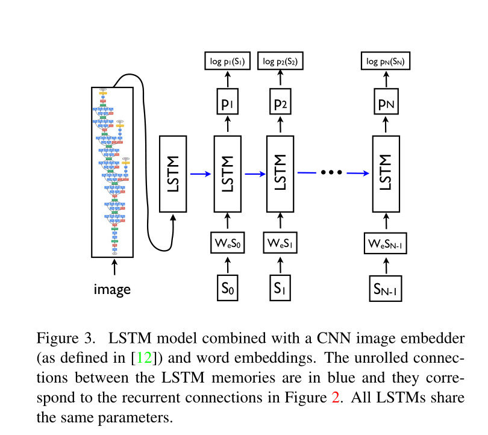
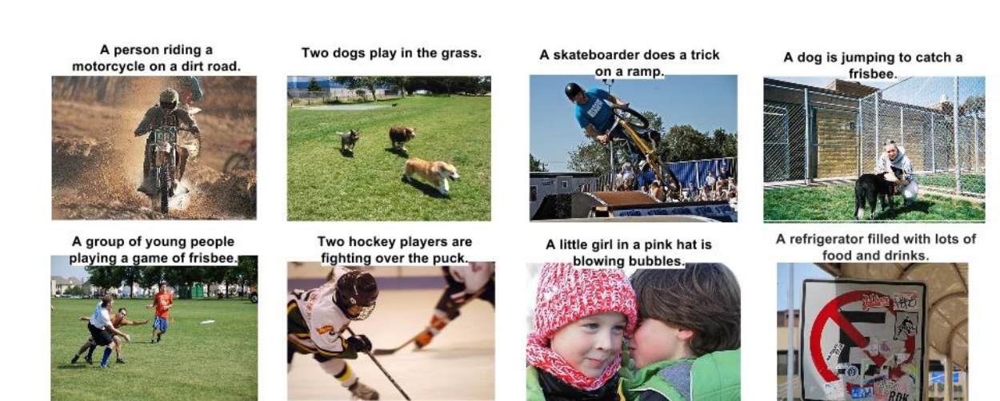
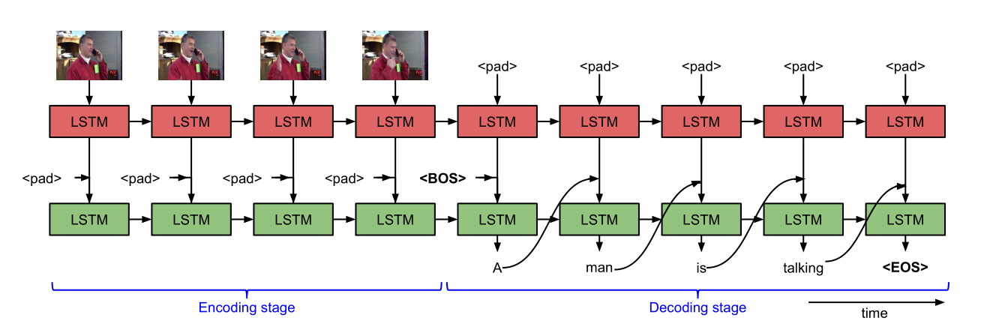
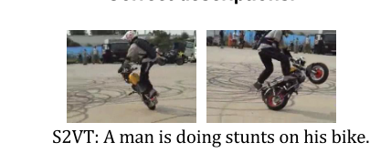

# image and video caption for 微信自动回复

## abstract

此项目需要配合autoReply_WX使用。

主体功能为：微信公众号自动回复。微信公众号将消息转发到autoReply_WX后，由autoReply_wx将各类消息路由
到各自个handler。

此项目的主要功能为image and video caption(图像内容描述)，主要用深度学习框架Keras编写，并利用RabbitMq接收任务消息。
由autoReply_WX将**视频或者图像消息**发送到RabbitMq，然后此项目作为接收端，接收并处理接收到的消息，
把处理结果返回给autoReply_Wx,由其发送给用户。


## 使用方法


需要将setting.py 中的以下配置修改为自己的RabbitMq的host:port
```
username = "guest"
password = "guest"
host = "106.13.50.135"
port = "5672"
```

然后

```bash
python main.py
```


## image caption





## video caption





## References：
[2015-Show and Tell A Neural Image Caption Generator](https://arxiv.org/abs/1411.4555v2)

[Sequence to Sequence – Video to Text](https://arxiv.org/abs/1505.00487)